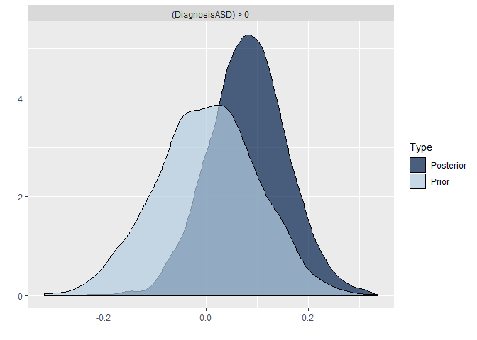

Assignment 4
------------

In this assignment we do the following: - we run a Bayesian meta-analysis of pitch variability in ASD, based on previously published literature - we analyze pitch variability in ASD in two new studies using both a conservative and a meta-analytic prior - we assess the difference in model quality and estimates using the two priors.

The questions you need to answer are: What are the consequences of using a meta-analytic prior? Evaluate the models with conservative and meta-analytic priors. Discuss the effects on estimates. Discuss the effects on model quality. Discuss the role that meta-analytic priors should have in scientific practice. Should we systematically use them? Do they have drawbacks? Should we use them to complement more conservative approaches? How does the use of meta-analytic priors you suggest reflect the skeptical and cumulative nature of science?

### Step by step suggestions

Step 1: Perform a meta-analysis of pitch variability from previous studies of voice in ASD - the data is available as Ass4\_MetaAnalysisData.tsv - You should calculate Effect size (cohen's d) and Standard Error (uncertainty in the Cohen's d) per each study, using escalc() from the metafor package (also check the livecoding intro) - N.B. we're only interested in getting a meta-analytic effect size for the meta-analytic prior (and not e.g. all the stuff on publication bias). See a brms tutorial here: <https://vuorre.netlify.com/post/2016/09/29/meta-analysis-is-a-special-case-of-bayesian-multilevel-modeling/> The formula is EffectSize | se(StandardError) ~ 1 + (1 | Paper). Don't forget prior definition, model checking, etc. - Write down the results of the meta-analysis in terms of a prior for step 2.

``` r
pacman::p_load(
  tidyverse, 
  metafor,
  brms) 

set.seed(123)

MA_d <- read_delim("Ass4_MetaAnalysisData.tsv", delim = "\t")
```

    ## Parsed with column specification:
    ## cols(
    ##   .default = col_double(),
    ##   Paper = col_character(),
    ##   Author = col_character(),
    ##   Population = col_character(),
    ##   DiagnosisDetails = col_character(),
    ##   Language = col_character(),
    ##   Language2 = col_character(),
    ##   Task = col_character(),
    ##   Task2 = col_character(),
    ##   PitchMean_Units = col_character(),
    ##   PitchMeanASDvsTD = col_character(),
    ##   PitchRange_Units = col_character(),
    ##   PitchRangeASDvsTD = col_character(),
    ##   PitchSD_Units = col_character(),
    ##   PitchSDASDvsTD = col_character(),
    ##   PitchVariability_Units = col_character(),
    ##   PitchVariabilityASDvsTD = col_character(),
    ##   IntensityMean_Units = col_character(),
    ##   IntensityMeanASDvsTD = col_character(),
    ##   UtteranceDurationUnit = col_character(),
    ##   UtteranceDurationASDvsTD = col_character()
    ##   # ... with 5 more columns
    ## )

    ## See spec(...) for full column specifications.

``` r
MA_d <- MA_d %>%
  mutate(
    PitchVariabilityASD_Mean = as.numeric(PitchVariabilityASD_Mean),
    PitchVariabilityTD_Mean = as.numeric(PitchVariabilityTD_Mean),
    PitchVariabilityASD_SD = as.numeric(PitchVariabilityASD_SD),
    PitchVariabilityTD_SD = as.numeric(PitchVariabilityTD_SD)
  )

MA_d <- MA_d %>% subset(!is.na(Paper))

MA_d <- escalc(measure = "SMD", #Standerdized mean difference
            n1i = TD_N,  #How many in each group
            n2i = ASD_N, 
            m1i = PitchVariabilityTD_Mean, #mean of each group
            m2i = PitchVariabilityASD_Mean,
            sd1i = PitchVariabilityTD_SD, #SD of each group
            sd2i = PitchVariabilityASD_SD,
            data = MA_d, 
            slab = Paper)

MA_d <- MA_d %>% 
  mutate(
    StandardError = sqrt(vi)
  ) %>% rename(
  EffectSize = yi
)

summary(MA_d$EffectSize)
```

    ##     Min.  1st Qu.   Median     Mean  3rd Qu.     Max.     NA's 
    ## -1.29110 -0.81658 -0.65338 -0.46315 -0.05907  0.52031       11

``` r
summary(MA_d$StandardError)
```

    ##    Min. 1st Qu.  Median    Mean 3rd Qu.    Max.    NA's 
    ##  0.2211  0.3176  0.3732  0.3673  0.4243  0.4826      11

``` r
MA_f <- bf(EffectSize | se(StandardError) ~ 1 + (1 | Population))

get_prior(MA_f, data = MA_d, family = gaussian())
```

    ## Warning: Rows containing NAs were excluded from the model.

    ##                  prior     class      coef      group resp dpar nlpar bound
    ## 1 student_t(3, -1, 10) Intercept                                           
    ## 2  student_t(3, 0, 10)        sd                                           
    ## 3                             sd           Population                      
    ## 4                             sd Intercept Population

``` r
MA_prior <- c(
  prior(normal(0, 1), class = Intercept), #Skeptical - mean of 0 = no effect, but quite likely that the effect size will be between -2 and 2
  prior(normal(0, .3), class = sd)
)

MA_m0 <- brm(
  MA_f,
  data = MA_d,
  family = gaussian(),
  prior = MA_prior,
  sample_prior = "only",
  chains = 2,
  cores = 2
)
```

    ## Warning: Rows containing NAs were excluded from the model.

    ## Compiling the C++ model

    ## Start sampling

``` r
pp_check(MA_m0, nsamples = 100)
```


``` r
MA_m1 <- brm(
  MA_f,
  data = MA_d,
  family = gaussian(),
  prior = MA_prior,
  sample_prior = T,
  chains = 2,
  cores = 2
)
```

    ## Warning: Rows containing NAs were excluded from the model.

    ## Compiling the C++ model
    ## Start sampling

``` r
pp_check(MA_m1, nsamples = 100)
```


``` r
summary(MA_m1)
```

    ##  Family: gaussian 
    ##   Links: mu = identity; sigma = identity 
    ## Formula: EffectSize | se(StandardError) ~ 1 + (1 | Population) 
    ##    Data: MA_d (Number of observations: 30) 
    ## Samples: 2 chains, each with iter = 2000; warmup = 1000; thin = 1;
    ##          total post-warmup samples = 2000
    ## 
    ## Group-Level Effects: 
    ## ~Population (Number of levels: 26) 
    ##               Estimate Est.Error l-95% CI u-95% CI Rhat Bulk_ESS Tail_ESS
    ## sd(Intercept)     0.32      0.10     0.13     0.53 1.01      782     1134
    ## 
    ## Population-Level Effects: 
    ##           Estimate Est.Error l-95% CI u-95% CI Rhat Bulk_ESS Tail_ESS
    ## Intercept    -0.44      0.10    -0.63    -0.25 1.00     1608     1219
    ## 
    ## Samples were drawn using sampling(NUTS). For each parameter, Bulk_ESS
    ## and Tail_ESS are effective sample size measures, and Rhat is the potential
    ## scale reduction factor on split chains (at convergence, Rhat = 1).

``` r
# MA effect mean = 0.43, sd = 0.1
MA_mean <- fixef(MA_m1)[[1]]
MA_se <- fixef(MA_m1)[[2]]

MA_heterogeneity = 0.32
```

Step 2: Analyse pitch variability in ASD in two new studies for which you have access to all the trials (not just study level estimates) - the data is available as Ass4\_data.csv. Notice there are 2 studies (language us, and language dk), multiple trials per participant, and a few different ways to measure pitch variability (if in doubt, focus on pitch IQR, interquartile range of the log of fundamental frequency) - Also, let's standardize the data, so that they are compatible with our meta-analytic prior (Cohen's d is measured in SDs). - Is there any structure in the dataset that we should account for with random/varying effects? How would you implement that? Or, if you don't know how to do bayesian random/varying effects or don't want to bother, is there anything we would need to simplify in the dataset?

``` r
d <- read_csv("Ass4_data.csv", col_types = cols(ID = col_character()))

#Standerdize pitch variability
d <- d %>% mutate(
  PitchVariability = scale(Pitch_IQR)
)

hist(d$Pitch_IQR)
```


``` r
hist(d$PitchVariability)
```


``` r
#Looks approx. Gaussian

# Which structure?
## Language - Fixed effect
## ID - Varying effect
```

Step 3: Build a regression model predicting Pitch variability from Diagnosis. - how is the outcome distributed? (likelihood function). NB. given we are standardizing, and the meta-analysis is on that scale, gaussian is not a bad assumption. Lognormal would require us to convert the prior to that scale. - how are the parameters of the likelihood distribution distributed? Which predictors should they be conditioned on? Start simple, with Diagnosis only. Add other predictors only if you have the time and energy! - use a skeptical/conservative prior for the effects of diagnosis. Remember you'll need to motivate it. - Evaluate model quality. Describe and plot the estimates.

``` r
#Make Diagnosis to factor, and relevel (to have TD first)
class(d$Diagnosis)
```

    ## [1] "character"

``` r
d$Diagnosis <- as.factor(d$Diagnosis)
d$Diagnosis <- relevel(d$Diagnosis, "TD")

#Formula
NewStudies_f0 <- bf(PitchVariability ~ 1 + Diagnosis + (1|ID))
NewStudies_f1 <- bf(PitchVariability ~ 0 + Language + Language:Diagnosis + (1|ID))

# Prior for first model
get_prior(NewStudies_f0, d, family = gaussian())
```

    ##                 prior     class         coef group resp dpar nlpar bound
    ## 1                             b                                         
    ## 2                             b DiagnosisASD                            
    ## 3 student_t(3, 0, 10) Intercept                                         
    ## 4 student_t(3, 0, 10)        sd                                         
    ## 5                            sd                 ID                      
    ## 6                            sd    Intercept    ID                      
    ## 7 student_t(3, 0, 10)     sigma

``` r
NS_prior0 <- c(
  prior(normal(0, .3), class = Intercept),
  prior(normal(0, .1), class = b),
  prior(normal(0, .1), class = sd), # Group level
  prior(normal(.5, .3), class = sigma) # Population level
)

NS_m0_pc <- brm(
  NewStudies_f0,
  d,
  family = gaussian(),
  prior = NS_prior0,
  sample_prior = "only",
  chains = 2,
  cores = 2
)
```

    ## Compiling the C++ model

    ## Start sampling

``` r
pp_check(NS_m0_pc, nsamples=100)
```


``` r
# First model
NS_m0 <- brm(
  NewStudies_f0,
  d,
  family = gaussian(),
  prior = NS_prior0,
  sample_prior = T,
  chains = 2,
  cores = 2
)
```

    ## Compiling the C++ model
    ## Start sampling

``` r
pp_check(NS_m0, nsamples=100)
```


``` r
# Hypothesis: DiagnosisASD is bigger than zero - i.e. pitch variability is bigger for ASD than TD
plot(hypothesis(NS_m0, "DiagnosisASD > 0")) 
```



``` r
hypothesis(NS_m0, "DiagnosisASD > 0")
```

    ## Hypothesis Tests for class b:
    ##           Hypothesis Estimate Est.Error CI.Lower CI.Upper Evid.Ratio Post.Prob
    ## 1 (DiagnosisASD) > 0     0.08      0.08    -0.04      0.2       6.22      0.86
    ##   Star
    ## 1     
    ## ---
    ## 'CI': 90%-CI for one-sided and 95%-CI for two-sided hypotheses.
    ## '*': For one-sided hypotheses, the posterior probability exceeds 95%;
    ## for two-sided hypotheses, the value tested against lies outside the 95%-CI.
    ## Posterior probabilities of point hypotheses assume equal prior probabilities.

``` r
summary(NS_m0)
```

    ##  Family: gaussian 
    ##   Links: mu = identity; sigma = identity 
    ## Formula: PitchVariability ~ 1 + Diagnosis + (1 | ID) 
    ##    Data: d (Number of observations: 1074) 
    ## Samples: 2 chains, each with iter = 2000; warmup = 1000; thin = 1;
    ##          total post-warmup samples = 2000
    ## 
    ## Group-Level Effects: 
    ## ~ID (Number of levels: 149) 
    ##               Estimate Est.Error l-95% CI u-95% CI Rhat Bulk_ESS Tail_ESS
    ## sd(Intercept)     0.65      0.04     0.58     0.71 1.00      817     1464
    ## 
    ## Population-Level Effects: 
    ##              Estimate Est.Error l-95% CI u-95% CI Rhat Bulk_ESS Tail_ESS
    ## Intercept        0.18      0.07     0.04     0.31 1.00      643     1139
    ## DiagnosisASD     0.08      0.08    -0.07     0.23 1.00      844     1185
    ## 
    ## Family Specific Parameters: 
    ##       Estimate Est.Error l-95% CI u-95% CI Rhat Bulk_ESS Tail_ESS
    ## sigma     0.71      0.02     0.67     0.74 1.00     2610     1513
    ## 
    ## Samples were drawn using sampling(NUTS). For each parameter, Bulk_ESS
    ## and Tail_ESS are effective sample size measures, and Rhat is the potential
    ## scale reduction factor on split chains (at convergence, Rhat = 1).

``` r
# Prior second model
get_prior(NewStudies_f1, d, family = gaussian())
```

    ##                 prior class                    coef group resp dpar nlpar bound
    ## 1                         b                                                    
    ## 2                         b              Languagedk                            
    ## 3                         b Languagedk:DiagnosisASD                            
    ## 4                         b              Languageus                            
    ## 5                         b Languageus:DiagnosisASD                            
    ## 6 student_t(3, 0, 10)    sd                                                    
    ## 7                        sd                            ID                      
    ## 8                        sd               Intercept    ID                      
    ## 9 student_t(3, 0, 10) sigma

``` r
NS_prior1 <- c(
  prior(normal(0, .3), class = b, coef = "Languagedk"),
  prior(normal(0, .3), class = b, coef = "Languageus"),
  prior(normal(0, .1), class = b, coef = "Languagedk:DiagnosisASD"),
  prior(normal(0, .1), class = b, coef = "Languageus:DiagnosisASD"),
  prior(normal(0, .1), class = sd),
  prior(normal(.5, .1), class = sigma)
)

NS_m1_pc <- brm(
  NewStudies_f1,
  d,
  family = gaussian(),
  prior = NS_prior1,
  sample_prior = "only",
  chains = 2,
  cores = 2
)
```

    ## Compiling the C++ model
    ## Start sampling

``` r
pp_check(NS_m1_pc, nsamples = 100)
```


``` r
# Second model
NS_m1 <- brm(
  NewStudies_f1,
  d,
  family = gaussian(),
  prior = NS_prior1,
  sample_prior = T,
  chains = 2,
  cores = 2
)
```

    ## Compiling the C++ model
    ## Start sampling

``` r
pp_check(NS_m1, nsamples=100)
```


``` r
# Hypothesis: DiagnosisASD is bigger than zero - i.e. pitch variability is bigger for ASD than TD
plot(hypothesis(NS_m1, "Languagedk:DiagnosisASD > 0"))
```


``` r
plot(hypothesis(NS_m1, "Languageus:DiagnosisASD > 0")) # Opposite direction
```


``` r
hypothesis(NS_m1, "Languagedk:DiagnosisASD > 0")
```

    ## Hypothesis Tests for class b:
    ##                 Hypothesis Estimate Est.Error CI.Lower CI.Upper Evid.Ratio
    ## 1 (Languagedk:Diagn... > 0     0.09      0.08    -0.05     0.22       6.07
    ##   Post.Prob Star
    ## 1      0.86     
    ## ---
    ## 'CI': 90%-CI for one-sided and 95%-CI for two-sided hypotheses.
    ## '*': For one-sided hypotheses, the posterior probability exceeds 95%;
    ## for two-sided hypotheses, the value tested against lies outside the 95%-CI.
    ## Posterior probabilities of point hypotheses assume equal prior probabilities.

``` r
hypothesis(NS_m1, "Languageus:DiagnosisASD > 0")
```

    ## Hypothesis Tests for class b:
    ##                 Hypothesis Estimate Est.Error CI.Lower CI.Upper Evid.Ratio
    ## 1 (Languageus:Diagn... > 0    -0.03      0.08    -0.16     0.11       0.56
    ##   Post.Prob Star
    ## 1      0.36     
    ## ---
    ## 'CI': 90%-CI for one-sided and 95%-CI for two-sided hypotheses.
    ## '*': For one-sided hypotheses, the posterior probability exceeds 95%;
    ## for two-sided hypotheses, the value tested against lies outside the 95%-CI.
    ## Posterior probabilities of point hypotheses assume equal prior probabilities.

``` r
# Hypothesis: The change in pithc variability from TD to ASD is bigger for language DK than langauge US
plot(hypothesis(NS_m1, "Languagedk:DiagnosisASD > Languageus:DiagnosisASD"))
```


``` r
hypothesis(NS_m1, "Languagedk:DiagnosisASD > Languageus:DiagnosisASD")
```

    ## Hypothesis Tests for class b:
    ##                 Hypothesis Estimate Est.Error CI.Lower CI.Upper Evid.Ratio
    ## 1 (Languagedk:Diagn... > 0     0.11      0.11    -0.07     0.29       5.41
    ##   Post.Prob Star
    ## 1      0.84     
    ## ---
    ## 'CI': 90%-CI for one-sided and 95%-CI for two-sided hypotheses.
    ## '*': For one-sided hypotheses, the posterior probability exceeds 95%;
    ## for two-sided hypotheses, the value tested against lies outside the 95%-CI.
    ## Posterior probabilities of point hypotheses assume equal prior probabilities.

``` r
conditional_effects(NS_m1)
```


``` r
summary(NS_m1)
```

    ##  Family: gaussian 
    ##   Links: mu = identity; sigma = identity 
    ## Formula: PitchVariability ~ 0 + Language + Language:Diagnosis + (1 | ID) 
    ##    Data: d (Number of observations: 1074) 
    ## Samples: 2 chains, each with iter = 2000; warmup = 1000; thin = 1;
    ##          total post-warmup samples = 2000
    ## 
    ## Group-Level Effects: 
    ## ~ID (Number of levels: 149) 
    ##               Estimate Est.Error l-95% CI u-95% CI Rhat Bulk_ESS Tail_ESS
    ## sd(Intercept)     0.51      0.03     0.44     0.57 1.01      605     1117
    ## 
    ## Population-Level Effects: 
    ##                         Estimate Est.Error l-95% CI u-95% CI Rhat Bulk_ESS
    ## Languagedk                 -0.31      0.08    -0.45    -0.16 1.00      505
    ## Languageus                  0.69      0.08     0.53     0.85 1.00     1221
    ## Languagedk:DiagnosisASD     0.09      0.08    -0.07     0.24 1.00     1086
    ## Languageus:DiagnosisASD    -0.03      0.08    -0.19     0.13 1.00     1725
    ##                         Tail_ESS
    ## Languagedk                  1051
    ## Languageus                  1412
    ## Languagedk:DiagnosisASD     1306
    ## Languageus:DiagnosisASD     1439
    ## 
    ## Family Specific Parameters: 
    ##       Estimate Est.Error l-95% CI u-95% CI Rhat Bulk_ESS Tail_ESS
    ## sigma     0.70      0.02     0.67     0.73 1.00     2040     1578
    ## 
    ## Samples were drawn using sampling(NUTS). For each parameter, Bulk_ESS
    ## and Tail_ESS are effective sample size measures, and Rhat is the potential
    ## scale reduction factor on split chains (at convergence, Rhat = 1).

``` r
plot(NS_m1)
```


``` r
# Model comparison
NS_m0 <- add_criterion(NS_m0, criterion = "loo", reloo = T)
```

    ## 6 problematic observation(s) found.
    ## The model will be refit 6 times.

    ## 
    ## Fitting model 1 out of 6 (leaving out observation 125)

    ## 
    ## Fitting model 2 out of 6 (leaving out observation 244)

    ## 
    ## Fitting model 3 out of 6 (leaving out observation 405)

    ## 
    ## Fitting model 4 out of 6 (leaving out observation 406)

    ## 
    ## Fitting model 5 out of 6 (leaving out observation 639)

    ## 
    ## Fitting model 6 out of 6 (leaving out observation 640)

    ## Start sampling
    ## Start sampling
    ## Start sampling
    ## Start sampling
    ## Start sampling
    ## Start sampling

``` r
NS_m1 <- add_criterion(NS_m1, criterion = "loo", reloo = T)
```

    ## 1 problematic observation(s) found.
    ## The model will be refit 1 times.

    ## 
    ## Fitting model 1 out of 1 (leaving out observation 640)

    ## Start sampling

``` r
loo_model_weights(NS_m0, NS_m1)
```

    ## Warning: Some Pareto k diagnostic values are too high. See help('pareto-k-diagnostic') for details.

    ## Warning: Some Pareto k diagnostic values are too high. See help('pareto-k-diagnostic') for details.

    ## Method: stacking
    ## ------
    ##       weight
    ## NS_m0 0.320 
    ## NS_m1 0.680

``` r
loo_compare(NS_m0, NS_m1)
```

    ##       elpd_diff se_diff
    ## NS_m1  0.0       0.0   
    ## NS_m0 -3.4       5.1

Step 4: Now re-run the model with the meta-analytic prior - Evaluate model quality. Describe and plot the estimates.

``` r
# Informed Prior
NS_informed_prior1 <- c(
  prior(normal(-0.215, .3), class = b, coef = "Languagedk"),
  prior(normal(-0.215, .3), class = b, coef = "Languageus"),
  prior(normal(0.43, .09), class = b, coef = "Languagedk:DiagnosisASD"),
  prior(normal(0.43, .09), class = b, coef = "Languageus:DiagnosisASD"),
  prior(normal(0, .1), class = sd),
  prior(normal(.32, .1), class = sigma)
)

NS_informed_m1_pc <- brm(
  NewStudies_f1,
  d,
  family = gaussian(),
  prior = NS_informed_prior1,
  sample_prior = "only",
  chains = 2,
  cores = 2
)
```

    ## Compiling the C++ model

    ## Start sampling

``` r
pp_check(NS_informed_m1_pc, nsamples = 100)
```


``` r
# Model
NS_informed_m1 <- brm(
  NewStudies_f1,
  d,
  family = gaussian(),
  prior = NS_informed_prior1,
  sample_prior = T,
  chains = 2,
  cores = 2
)
```

    ## Compiling the C++ model
    ## Start sampling

``` r
pp_check(NS_informed_m1, nsamples = 100)
```


``` r
plot(hypothesis(NS_informed_m1, "Languagedk:DiagnosisASD > 0"))
```


``` r
plot(hypothesis(NS_informed_m1, "Languageus:DiagnosisASD > 0"))
```


``` r
hypothesis(NS_informed_m1, "Languagedk:DiagnosisASD > 0")
```

    ## Hypothesis Tests for class b:
    ##                 Hypothesis Estimate Est.Error CI.Lower CI.Upper Evid.Ratio
    ## 1 (Languagedk:Diagn... > 0     0.38      0.07     0.25      0.5        Inf
    ##   Post.Prob Star
    ## 1         1    *
    ## ---
    ## 'CI': 90%-CI for one-sided and 95%-CI for two-sided hypotheses.
    ## '*': For one-sided hypotheses, the posterior probability exceeds 95%;
    ## for two-sided hypotheses, the value tested against lies outside the 95%-CI.
    ## Posterior probabilities of point hypotheses assume equal prior probabilities.

``` r
hypothesis(NS_informed_m1, "Languageus:DiagnosisASD > 0")
```

    ## Hypothesis Tests for class b:
    ##                 Hypothesis Estimate Est.Error CI.Lower CI.Upper Evid.Ratio
    ## 1 (Languageus:Diagn... > 0     0.29      0.07     0.17     0.41        Inf
    ##   Post.Prob Star
    ## 1         1    *
    ## ---
    ## 'CI': 90%-CI for one-sided and 95%-CI for two-sided hypotheses.
    ## '*': For one-sided hypotheses, the posterior probability exceeds 95%;
    ## for two-sided hypotheses, the value tested against lies outside the 95%-CI.
    ## Posterior probabilities of point hypotheses assume equal prior probabilities.

``` r
plot(hypothesis(NS_informed_m1, "Languagedk:DiagnosisASD > Languageus:DiagnosisASD"))
```


``` r
hypothesis(NS_informed_m1, "Languagedk:DiagnosisASD > Languageus:DiagnosisASD")
```

    ## Hypothesis Tests for class b:
    ##                 Hypothesis Estimate Est.Error CI.Lower CI.Upper Evid.Ratio
    ## 1 (Languagedk:Diagn... > 0     0.09      0.11    -0.09     0.26       4.13
    ##   Post.Prob Star
    ## 1       0.8     
    ## ---
    ## 'CI': 90%-CI for one-sided and 95%-CI for two-sided hypotheses.
    ## '*': For one-sided hypotheses, the posterior probability exceeds 95%;
    ## for two-sided hypotheses, the value tested against lies outside the 95%-CI.
    ## Posterior probabilities of point hypotheses assume equal prior probabilities.

``` r
conditional_effects(NS_informed_m1)
```


``` r
summary(NS_informed_m1)
```

    ##  Family: gaussian 
    ##   Links: mu = identity; sigma = identity 
    ## Formula: PitchVariability ~ 0 + Language + Language:Diagnosis + (1 | ID) 
    ##    Data: d (Number of observations: 1074) 
    ## Samples: 2 chains, each with iter = 2000; warmup = 1000; thin = 1;
    ##          total post-warmup samples = 2000
    ## 
    ## Group-Level Effects: 
    ## ~ID (Number of levels: 149) 
    ##               Estimate Est.Error l-95% CI u-95% CI Rhat Bulk_ESS Tail_ESS
    ## sd(Intercept)     0.52      0.03     0.46     0.59 1.00      898     1331
    ## 
    ## Population-Level Effects: 
    ##                         Estimate Est.Error l-95% CI u-95% CI Rhat Bulk_ESS
    ## Languagedk                 -0.43      0.07    -0.57    -0.29 1.00      446
    ## Languageus                  0.50      0.08     0.35     0.66 1.00      795
    ## Languagedk:DiagnosisASD     0.38      0.07     0.23     0.52 1.00     1088
    ## Languageus:DiagnosisASD     0.29      0.07     0.14     0.43 1.00     1591
    ##                         Tail_ESS
    ## Languagedk                   683
    ## Languageus                  1348
    ## Languagedk:DiagnosisASD     1359
    ## Languageus:DiagnosisASD     1534
    ## 
    ## Family Specific Parameters: 
    ##       Estimate Est.Error l-95% CI u-95% CI Rhat Bulk_ESS Tail_ESS
    ## sigma     0.70      0.02     0.67     0.73 1.00     2398     1270
    ## 
    ## Samples were drawn using sampling(NUTS). For each parameter, Bulk_ESS
    ## and Tail_ESS are effective sample size measures, and Rhat is the potential
    ## scale reduction factor on split chains (at convergence, Rhat = 1).

``` r
plot(NS_informed_m1)
```


``` r
# Model comparison
NS_informed_m1 <- add_criterion(NS_informed_m1, criterion = "loo", reloo = T)
```

    ## 4 problematic observation(s) found.
    ## The model will be refit 4 times.

    ## 
    ## Fitting model 1 out of 4 (leaving out observation 125)

    ## 
    ## Fitting model 2 out of 4 (leaving out observation 639)

    ## 
    ## Fitting model 3 out of 4 (leaving out observation 640)

    ## 
    ## Fitting model 4 out of 4 (leaving out observation 770)

    ## Start sampling
    ## Start sampling
    ## Start sampling
    ## Start sampling

Step 5: Compare the models - Plot priors and posteriors of the diagnosis effect in both models - Compare posteriors between the two models - Compare the two models (LOO) - Discuss how they compare and whether any of them is best.

``` r
loo_model_weights(NS_m1, NS_informed_m1)
```

    ## Warning: Some Pareto k diagnostic values are too high. See help('pareto-k-diagnostic') for details.

    ## Warning: Some Pareto k diagnostic values are too high. See help('pareto-k-diagnostic') for details.

    ## Method: stacking
    ## ------
    ##                weight
    ## NS_m1          0.851 
    ## NS_informed_m1 0.149

``` r
loo_compare(NS_m1, NS_informed_m1)
```

    ##                elpd_diff se_diff
    ## NS_informed_m1  0.0       0.0   
    ## NS_m1          -1.1       2.1

``` r
plot(hypothesis(NS_m1, "Languagedk:DiagnosisASD > 0"))
```


``` r
plot(hypothesis(NS_m1, "Languageus:DiagnosisASD > 0"))
```


``` r
plot(hypothesis(NS_informed_m1, "Languagedk:DiagnosisASD > 0"))
```


``` r
plot(hypothesis(NS_informed_m1, "Languageus:DiagnosisASD > 0"))
```


``` r
## use the posterior function 
```

Step 6: Prepare a nice write up of the analysis and answer the questions at the top.

Optional step 7: how skeptical should a prior be? - Try different levels of skepticism and compare them using LOO.

Optional step 8: Include other predictors - Do age, gender and education improve the model? - Should they be main effects or interactions?
